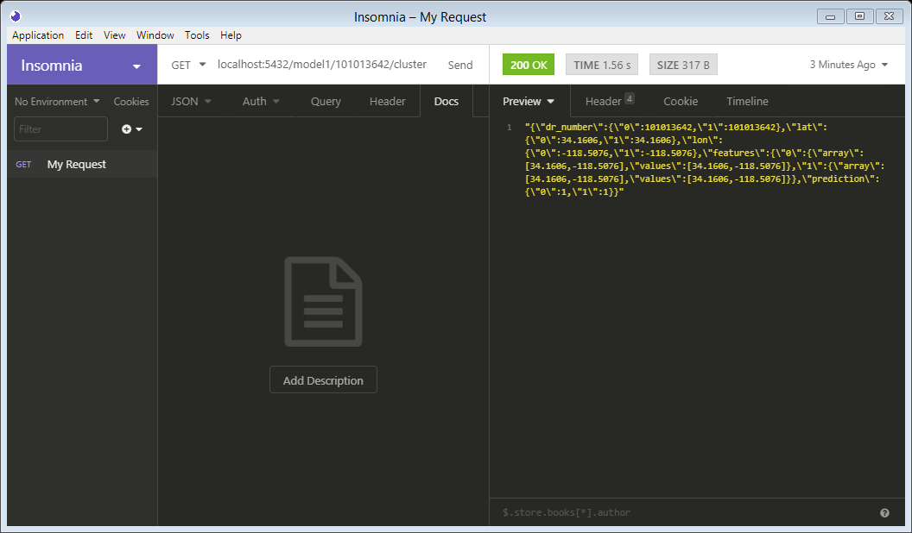
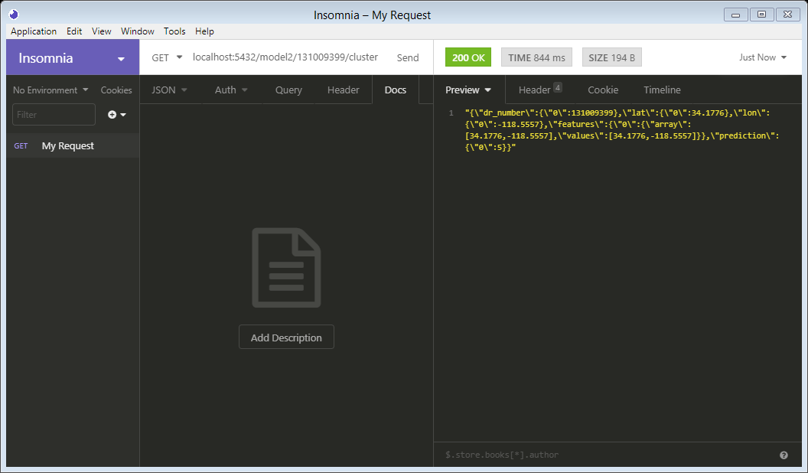

# final-project
Clustering Engine menggunakan dataset __Crime in Los Angeles__ (https://www.kaggle.com/cityofLA/crime-in-los-angeles)

## Daftar File
  * `producer.py` sebagai publisher yang akan mengirimkan data per baris ke Kafka Server seperti sedang melakukan streaming
  * `consumer.py` sebagai subscriber yang akan membaca data yang ada di dalam Kafka server dan akan menyimpan data yang diterima    dalam bentuk batch 
  * `server.py` dijalankan pertama kali untuk inisiasi
  * `app.py` sebagai aplikasi web Flask yang mendefinisikan RESTful API, menyediakan routing
  * `engine.py` sebagai clustering engine, di dalamnya tedapat semua komputasi terkait Spark
  
## Model
  1. Model 1: 1000 data pertama
  2. Model 2: 1000 data pertama
  3. Model 3: 1000 data pertama
   
## Cara Menjalankan
  1. Jalankan Zookeper
  2. Jalankan Kafka
     ```
     .\bin\windows\kafka-server-start.bat .\config\server.properties
     ```
  3. Buat topic baru pada Kafka 
     (project ini menggunakan contoh nama topik: crime)
     ```
     kafka-topics.bat --create --zookeeper localhost:2181 --replication-factor 1 --partitions 1 --topic crime
     ```
  4. Jalankan producer.py
     ```
     python producer.py
     ```
  5. Jalankan consumer.py
     ```
     python consumer.py
     ```
  6. Tunggu beberapa saat sampai producer mengirim data ke consumer
  7. Jalankan server.py
     ```
     python server.py
     ```
  
## URL / End Point
  * __[GET] http://IP_SERVER:5432/model1/{c_id}/cluster \
    Menampilkan hasil cluster model 1 dari suatu input \
    
    
  * __[GET] http://IP_SERVER:5432/model2/{c_id}/cluster \
    Menampilkan hasil cluster model 2 dari suatu input \
    
    
  * __[GET] http://IP_SERVER:5432/model3/{c_id}/cluster \
    Menampilkan hasil cluster model 3 dari suatu input \
    
