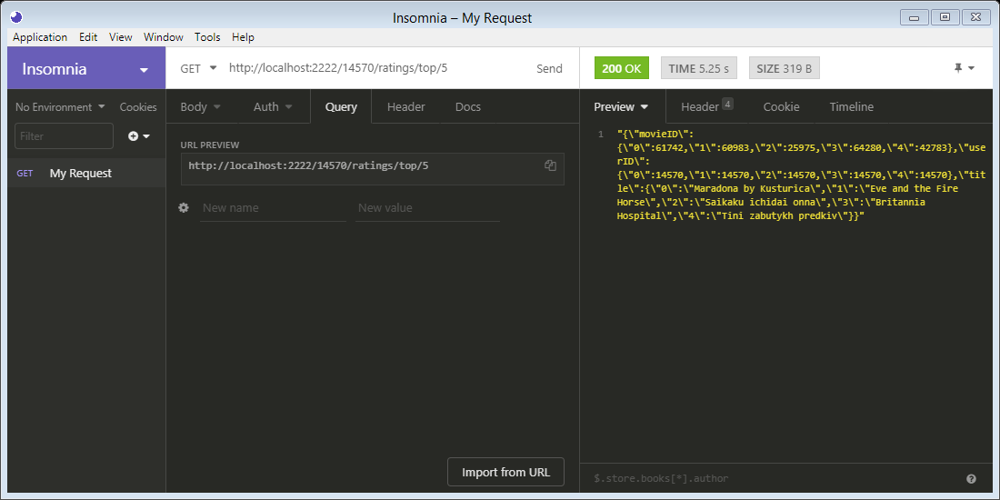
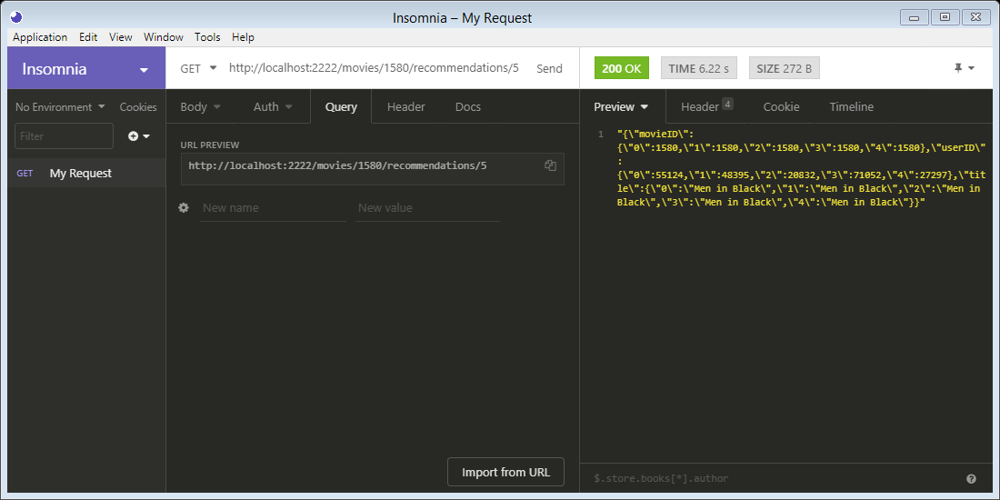
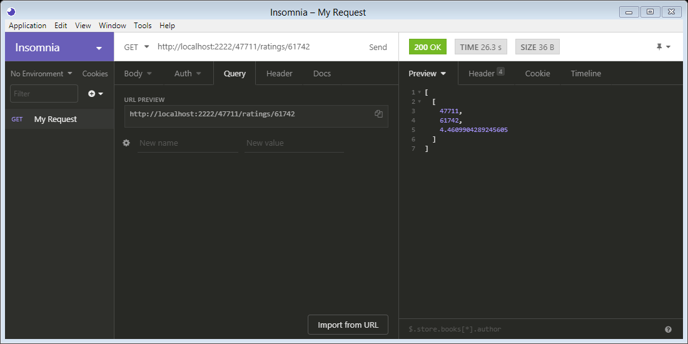
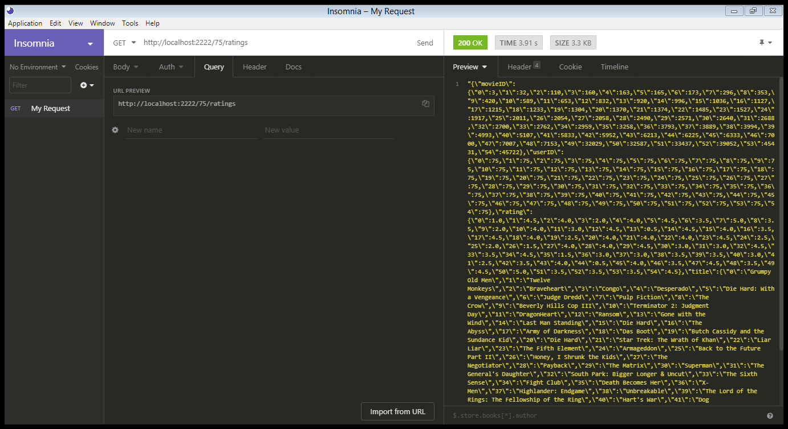
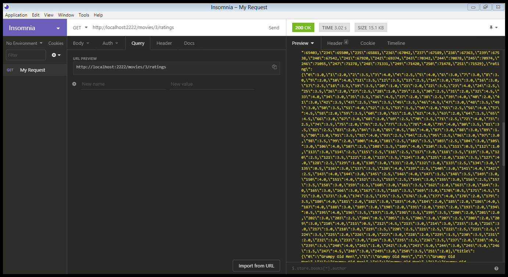

# recommendation-systems

  * `engine.py` defines the recommendation engine, wrapping insde all the Spark related computations.
  * `app.py` is a Flask web application that defines a RESTful-like API around the engine.
  * `server.py` initialises a CherryPy webserver after creating a Spark context and Flask web app using the previous.

## URL / End Point
  * __[GET] http://IP_SERVER:2222/{userID}/ratings/top/{count}__ \
    Menampilkan rekomendasi film sejumlah {count} untuk user {userID} \
    
    
  * __[GET] http://IP_SERVER:2222/movies/{movieID}/recommendations/{count}__ \
    Menampilkan film {movieID} untuk direkomendasikan ke sejumlah {count} user \
     
  * __[GET] http://IP_SERVER:2222/{userID}/ratings/{movieID}__ \
    Menampilkan prediksi rating yang diberikan user {userID} terhadap film {movieID} \
     
  * __[GET] http://IP_SERVER:2222/{userID}/ratings__ \
    Menampilkan riwayat pemberian rating dari user {userID} \
     
  * __[GET] http://IP_SERVER:2222/movies/{movieID}/ratings__ \
    Menampilkan riwayat rating yang didapatkan oleh film {movieID} \
     
